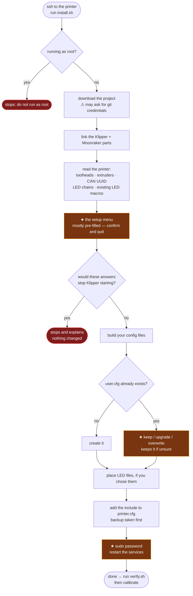

# Installing the autoloader

This guide assumes you have never seen this project before and are not a
programmer. It tells you what you are about to install, what it will change on
your printer, and what to do if it goes wrong.

---

## What this is

An **automatic filament loader for a multi-toolhead printer** — a
StealthChanger or similar with several tool docks.

Each toolhead gets its own filament path from its own spool. One motor selects
which path to work on, another pushes or pulls the filament, and a servo grips
or releases it. Sensors watch each path so the machine knows what is where.

It does two jobs:

- **A spool runs out** → it loads new filament into that toolhead for you.
- **You want a different colour** → it unloads the old one and loads the new.

**What it is not.** It is not an MMU. Filament never leaves its path during a
tool change — your toolchanger already handles that by physically swapping
heads. There is no colour changing mid-print on a single toolhead.

---

## What it will change on your printer

Being blunt about this, because you should know before you start:

| It does this | Where |
|---|---|
| Creates six symlinks into your Klipper install | `~/klipper/klippy/extras/` |
| Creates one symlink into Moonraker | `~/moonraker/moonraker/components/` |
| Creates a new folder of config files | `~/printer_data/config/autoloader/` |
| Adds **one line** to your `printer.cfg` (with a backup first) | `[include autoloader/autoloader.cfg]` |
| Adds an entry so Mainsail/Fluidd can update it | Moonraker's update manager |
| Copies touchscreen panels, if you have KlipperScreen | `~/KlipperScreen/panels/` |
| Restarts Klipper, Moonraker and KlipperScreen | only if you say yes |

**What it does not touch:** your existing printer config, your macros, your
LEDs (unless you ask), your bed mesh, or anything you have tuned. The only
edit to a file you already own is that single `[include]` line, and it takes a
timestamped backup first.

**It will not start doing anything on its own.** Installing it adds commands;
it does not move a motor until you run one.

---

## Before you start

You need:

- **A working printer.** Klipper running, prints working. This is an add-on,
  not a way to fix a broken setup.
- **The autoloader hardware built and wired.** Software cannot find a board
  that is not plugged in.
- **SSH access to the Pi** (or whatever runs Klipper). If you have flashed
  Klipper firmware, you have done this before — it is the same connection.
- **20 minutes**, plus calibration afterwards.

It is worth taking a backup of your config folder first. If you already back
up your printer, do that. If not:

```bash
tar -czf ~/config-backup-$(date +%F).tar.gz ~/printer_data/config
```

---

## Installing

SSH into the printer, then paste this **one line** and press Enter:

```bash
cd ~ && git clone https://github.com/Cstm3DBldr/autoloader.git && ~/autoloader/install.sh
```

That downloads the project and starts setup. It will ask you things — the next
section walks through each one.

---

## What it asks you

A menu opens. **It is the same menu Klipper uses to build firmware**, so if you
have ever flashed a board you have used it before.

```
  arrow keys   move around          Enter    open a menu
  Y / N        turn a thing on/off  ?        explain this setting
  Q            save and quit        Esc Esc  go back one level
```

**Before the menu opens, the installer reads your printer** and fills in
whatever it can work out — how many toolheads you have, what your extruders are
called, your CAN bus ID, what your LEDs are called. So most of this is
confirming, not typing.

**Everything has a default. If you do not know an answer, leave it alone.**

### 1. Your printer

**How many toolheads?** Usually filled in for you by counting the tools in your
toolchanger config. Six is typical for a StealthChanger.

**What are the extruders called?** Klipper names them `extruder`, `extruder1`,
`extruder2`… Leave this alone unless you renamed them yourself.

### 2. The autoloader board

**Which board?** The board driving the autoloader — *not* your printer's main
board and *not* a toolhead board. If yours is not listed, choose "Other" and
you will get a blank pin map to fill in by hand.

**How is it connected?** CAN bus for the usual build.

**CAN UUID.** A 12-character code like `329ce333239a` that identifies your
board. The installer looks it up for you. If it cannot find one it says so —
leave it as `CHANGE_ME`, finish the install, and run:

```bash
python3 ~/klipper/scripts/canbus_query.py can0
```

Then put the number it prints into `~/printer_data/config/autoloader/user.cfg`.

### 3. Sensors you actually have

Entry sensors are required. The other two are optional but earn their keep:

**A sensor at each extruder entry, before the gears?** Say yes if you fitted
them. Without them the machine cannot measure your Bowden tube lengths
automatically — you would have to measure each one with a tape and type it in.

**A sensor past the gears, before the hotend?** This is what confirms filament
actually reached the nozzle. Without it, a load that slipped still reports
success.

### 4. Toolchanger

Say yes for a StealthChanger or anything using klipper-toolchanger. The
autoloader uses it to switch to a toolhead before loading it.

### 5. Toolhead status LEDs

**Optional, and off by default.** Nothing about loading or unloading needs
them. If your LEDs already work and you would rather not risk it, choose
"None" — you can turn them on later without reinstalling.

- **None** — leave your LEDs alone.
- **Filament colour on the logo only** — your existing LEDs keep doing what
  they do; the autoloader only lights the Voron logo in the colour of the
  filament in that path. **Choose this if you already have working LEDs.**
- **Full** — replaces your status LEDs entirely.

**The installer will refuse "Full" if it would break your printer.** The full
option includes macros with the same names as the standard Voron LED config,
and Klipper will not start with both. It checks, and stops you.

### 6. What the installer is allowed to touch

Whether it may add the include line to your `printer.cfg`, register with the
update manager, and restart services. Yes to all three is normal.

---

## After the menu

It builds your config and prints what it did. Then it asks for your **sudo
password** to restart the services — that is the second and last prompt.

Check it worked:

```bash
~/autoloader/scripts/verify.sh
```

Everything should be ticks. If not, the section below.

---

## Then: calibration

**The autoloader will not work correctly until it is calibrated.** It does not
know how long your tubes are or how far your selector travels. Run these in the
Mainsail/Fluidd console, in order:

1. `SA_BUZZ_DRIVE` then `SA_BUZZ_SELECTOR` — do the motors move?
2. `SA_ENGAGE` then `SA_DISENGAGE` — does the servo move?
3. `SA_HOME` — does the selector find its endstop?
4. `SA_CALIBRATE_SELECTOR` — works out where each path sits.
5. Load filament into path 0 by hand, up past the drive gear.
6. `SA_CALIBRATE_DRIVE` — calibrates how far one motor turn moves filament.
7. `SA_CALIBRATE_ENCODER TOOL=0` — repeat for each path.
8. `SA_CALIBRATE_BOWDEN TOOL=0` — repeat for each path. Needs extruder sensors.
9. `SA_LOAD TOOL=0` — the real thing.

These values are saved automatically in
`~/printer_data/config/autoloader/variables.cfg` and **no update will ever
overwrite them**.

---

## If something goes wrong

**Klipper will not start after installing.**
Look at the error in Mainsail — it names the file and line. The most common
cause is an LED macro name clash; see [LEDS.md](LEDS.md). To get printing
again immediately, comment out the include in `printer.cfg`:

```
#[include autoloader/autoloader.cfg]
```

and restart Klipper. Nothing else is affected.

**"Unknown pin chip name" or a pin error.**
The CAN UUID is probably wrong or the board is not powered. Check with
`python3 ~/klipper/scripts/canbus_query.py can0`.

**A command like `SA_LOAD` does not exist.**
Klipper did not load the Python part. Run `~/autoloader/scripts/verify.sh` —
it checks the symlinks.

**I want to change an answer I gave.**
Run `~/autoloader/install.sh` again. It remembers what you chose, and
regenerating **keeps every value you have tuned or calibrated**. It asks before
touching your `user.cfg`, and defaults to leaving it alone.

---

## Removing it

```bash
~/autoloader/install.sh --uninstall
```

This removes the symlinks and config folder. **It copies your calibration,
your settings and your LED config aside first** into
`~/autoloader-config-backup-<number>/` and tells you where. Then remove the
include line from `printer.cfg` and restart Klipper.

---

## The whole flow, on one page

Two prompts, at most. Everything else runs by itself.



The `user.cfg` prompt only appears when you are re-installing. With no terminal
attached — a scripted run — it keeps your file rather than guessing.

---

## Where your things live, and what can overwrite them

| File | What it is | Safe from updates? |
|---|---|---|
| `autoloader/variables.cfg` | everything you calibrated | **yes** — never in the project, never written by an update |
| `autoloader/user.cfg` | your settings; overrides anything else | **yes** — written once, only changed if you say so |
| `autoloader/leds/` | your LED config | **yes** — created empty and never written again |
| `autoloader/parameters.cfg` | tunable values | rebuilt on update, **but your values are carried over** |
| `autoloader/hardware.cfg`, `pin_aliases.cfg` | built from your answers | rebuilt on update, your values carried over |
| everything else in that folder | project files | replaced on every update |

The rule: **anything you want to keep for certain goes in `user.cfg`.** It is
included last, so a value there beats the same value anywhere else.
