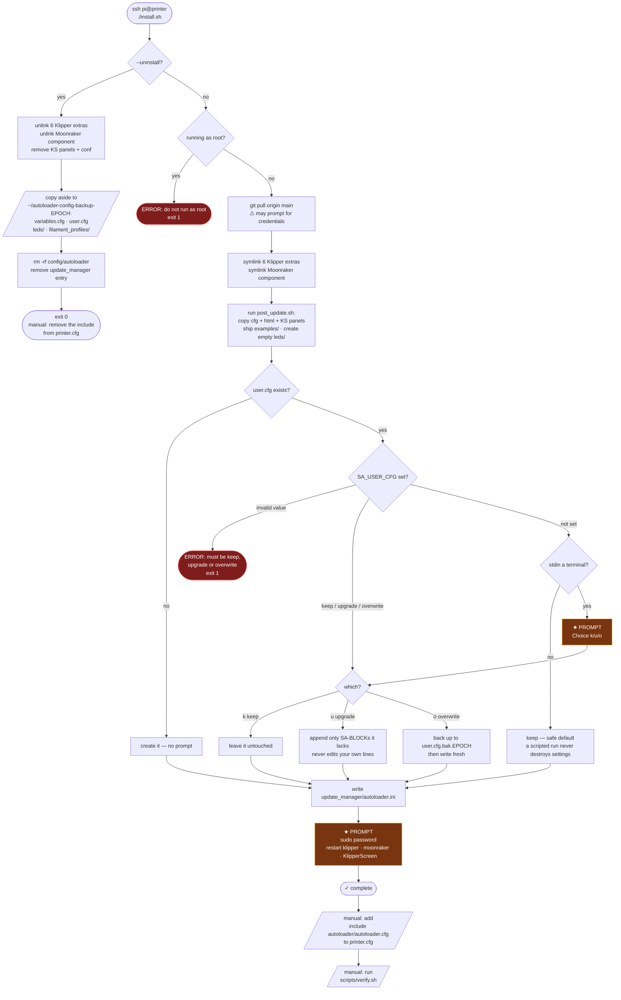

# Install flow — what an SSH session actually asks you

```bash
cd ~ && git clone https://github.com/Cstm3DBldr/autoloader.git && ~/autoloader/install.sh
```

**Two prompts, at most.** Everything else runs unattended. Both are marked ★
below. A third can appear if `git pull` needs credentials or hits local edits.



## The prompts in detail

### ★ 1 — `user.cfg` already exists

Only fires on a **re-install**. `user.cfg` holds your LED switch and any
`[autoloader]` values you moved there to protect them from `post_update.sh`, so
the installer will not touch it without asking.

```
[INSTALL] .../user.cfg already exists.
          It may hold settings that override parameters.cfg.

            k) Keep it as it is                      (default, safe)
            u) Upgrade — append only blocks it is missing, change nothing else
            o) Overwrite — back the current one up first

          Choice [k/u/o]:
```

| answer | effect |
|---|---|
| `k` | nothing changes |
| `u` | appends only marker-fenced blocks your file lacks, under a dated banner. Never removes, reorders, or edits a line you wrote |
| `o` | copies to `user.cfg.bak.<epoch>` first, then writes a fresh template |

Skip it entirely with `SA_USER_CFG=keep|upgrade|overwrite`. **With no terminal
attached it keeps** — a piped or scripted run must never destroy settings by
falling through a prompt nobody answered.

### ★ 2 — sudo password

For `systemctl restart klipper / moonraker / KlipperScreen`. Not asked on a
machine with passwordless sudo for those units.

### ⚠ possible — git

`git pull origin main` can ask for credentials on a private remote, or stop on
local edits to tracked files.

## What is never prompted, and is safe anyway

- **Your calibration.** `variables.cfg` — every bowden length, encoder
  mm/pulse and selector position — is not in the repo, so no install or update
  writes it. Uninstall copies it aside before removing anything.
- **Your LED config.** `leds/` is created empty and never written again.
- **Your `user.cfg`.** Written once; after that only with your answer above.

Everything else under `~/printer_data/config/autoloader/` **is** replaced on
every update. That is what `user.cfg` is for.
